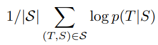
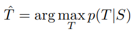
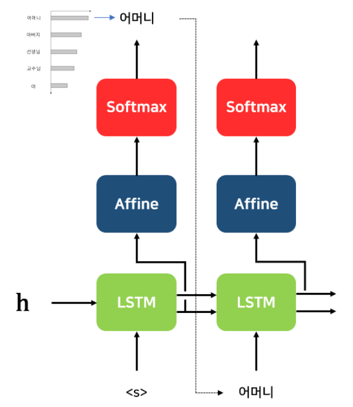
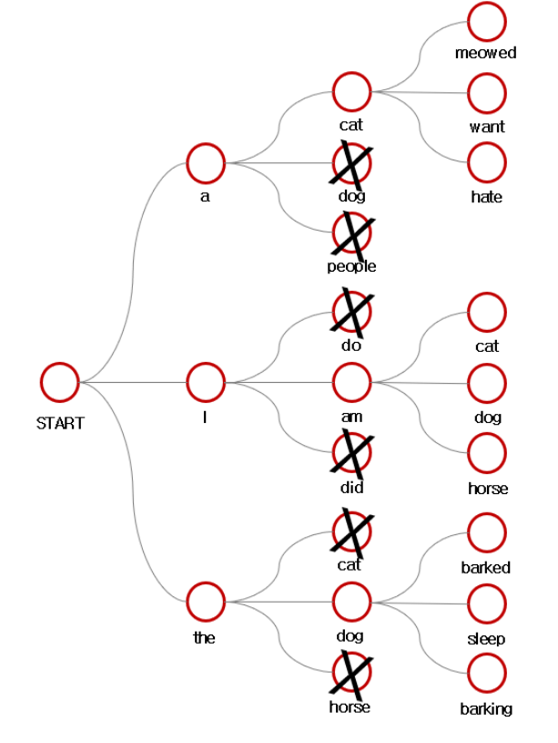
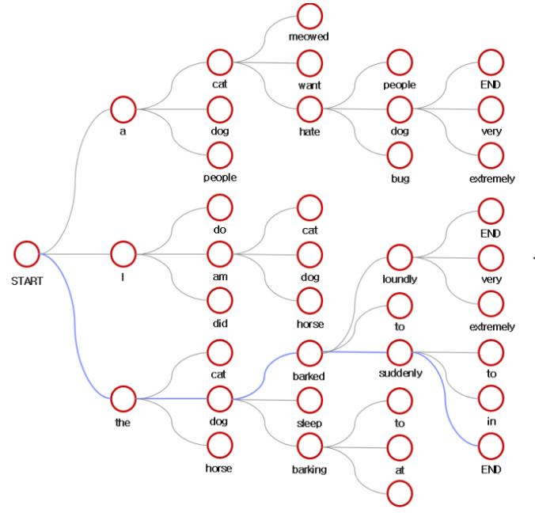
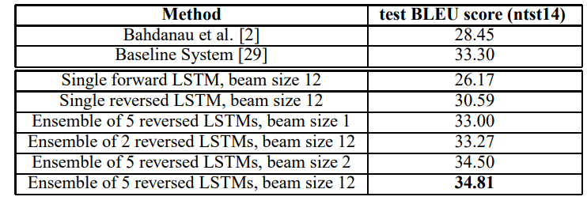
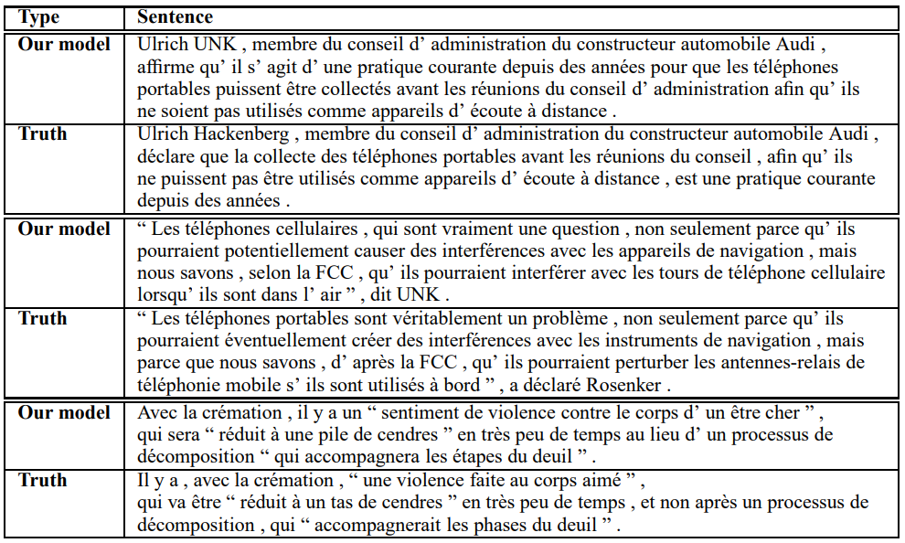
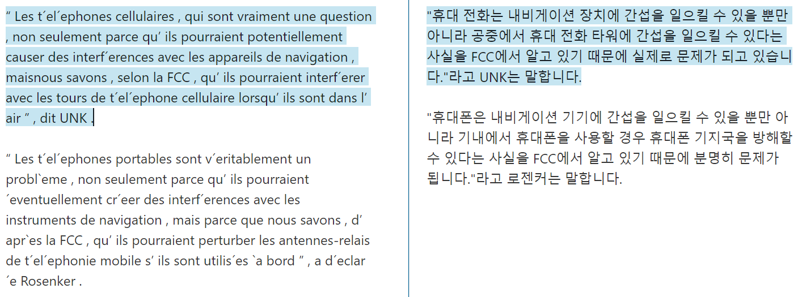

# Seq2Seq paper review

## Introduce
- Deep Neural Networks(심층 신경망)은 입력과 출력의 크기(Sequence)가 고정돼야 하는 큰 문제가 있음.
- Multi-layered Long short-Term Memory(LSTM)을 사용하여 입력 Sequence를 고정된 차원의 벡터로 mapping(Encoder), 다른 LSTM을 이용해 해당 벡터로 Target Sequence를 decoding함(Decoder).

## Sequence

### What is Sequence?
- Sequence : 일련의(연속적인) 사건들 → 연속적인 단어들
- 크기가 다양할 수 있음.
- **"what will the fat cat sit on"**

### Sequence data
- 일상에서 접할 수 있는 일반적인 데이터 형태
- 음성 데이터, 손 동작, 영상 데이터 등등
- CNN 혹은 Deep Neural Netwrok로 학습이 어려움.
    - 시간이 지남에 따라 데이터 양이 증가.
    - 입력이 언제 시점에 종료되는지 알 수가 없음.
        - 입력이 차원이 정해지지 않음.

### Sequence model
- 연속적인 입력으로부터 연속적인 출력을 생성하는 모델.
    - 간단히 이전 데이터가 들어오면 다음을 예측하는 모델.
    - 입력과 출력을 Sequence data를 활용하는 모델.
    - 대부분 autoregressive한 특성이 있음.
        - 현재 시점을 이전 시점의 값으로 인해 결정되는 구조(통계학 용어)

<br>

- 피드 포워드 신경망(Feed-forward Neural Network)
    - NNLM(Neural Network Language Model)
        - 정해진 개수의 단어 만을 참고하여 다음 단어 예측.
        - window를 4라고 가정하면 will the fat cat을 이용해 sit을 예측.   
          

        [이미지출처](https://wikidocs.net/45609)
    - Input layer에서 Output layer로 정보가 한 방향으로 전파됨.
    - 고정된 길이라는 것이 한계

    - Word2Vec
        - CBOW: 주변 단어를 입력 받아 중심 단어 예측.
        - Skip-gram: 중심 단어를 입력 받아 주변 단어 예측.

        - 앞의 n개가 아니라 앞 뒤로 n개를 입력을 받고 ouput으로 예측.
        - Input layer에서 Output layer로 정보가 한 방향으로 전파됨.
        - 고정된 크기를 입력을 받고 출력으로 내보냄.
        - 보통, RNN 혹은 LSTM에 넣기 전에 단어를 Embedding하는 모델로 사용.

    - RNN(Recurrent Neural Network)      
      
    [이미지출처](https://wikidocs.net/22886)
    
    - Feed Forward 방식이 아니라, 은닉층의 출력이 다시 은닉층의 입력으로 들어가는 재귀적인 연결이 특징.
    - 이를 통해 이전 시점의 정보를 현재 시점에서 활용할 수 있다.
    - RNN은 Sequence의 길이에 제한이 없어, 가변 길이의 Sequence를 처리할 수 있다.  
          

        [이미지출처](https://blog.naver.com/PostView.nhn?blogId=winddori2002&logNo=221974391796)  
    
    - RNN 내부  
      

    [이미지출처](https://wikidocs.net/22888)  
    - Hidden Layer : $h_t = tanh(W_xx_t + W_hh_{t-1} $
    - Output Layer : $y_t = f(W_yh_t +b)$
        - f는 Non-linear 활성화 함수 중 하나.(Sigmoid, Relu, Tanh)
    - RNN 한계
        - 장기 의존성 문제(the problem of Long-Term Dependencies)
        - Backpropation Through Time(BPTT)를 통한 역전파로 인한 Gradient Vanishing 문제.
        - 비교적 짧은 Sequence에서는 좋은 성능을 보이나 t가 커질수록 앞 쪽에 있는 정보들이 뒤쪽까지 충분히 전달되지 못함.
        - ''모스크바에 여행을 왔는데 건물도 예쁘고 먹을 것도 맛있었어. 그런데 글쎄 직장 상사한테 전화가 왔어. 어디냐고 묻더라구 그래서 나는 말했지. 저 여행왔는데요. 여기 ___'’ 에서 모스크바에서 __까지 28개의 단어가 존재.
            - 만약 RNN의 이전 정보를 제대로 기억하고 있지 않다면, 이상한 값이 나올 확률이 높다.

## LSTM(Lost shot Term memory)
- RNN이 이론적으로 long-term dependencies를 완전히 다룬다고 하지만 실제 문제에선 그렇지 않다. 이를 해결하기 위해 LSTM이 등장했다.
- LSTM도 RNN의 한 종류다. 모든 RNN은 neural network 모듈을 반복 시키는 체인 구조로 반복되는 단순한 구조를 가지고 있다. LSTM도 같은 체인 구조를 가지는데, 단순한 neural network layer 한 층이 아닌 4개의 layer가 상호작용 한다.
- 논문에서는 LSTM을 사용해 입력 문장을 고정 차원의 벡터 표현으로 매핑한다.  
         

      

    [이미지출처](http://colah.github.io/posts/2015-08-Understanding-LSTMs/)
    
    - 각 선은 한 노드의 output을 다른 노드의 input으로 벡터 전체를 보내는 흐름
    - 분홍색은 Point Operation은 vector간의 연산을 의미.
    - 노란 박스는 학습된 Neural Network Layer
    - 크게 main Flow, forget gate, input gate, output gate로 나눌 수 있음.

- Main Flow  
      

    - cell state
        - 이전 상태에서 현재 상태까지 유지되는 정보의 흐름을 나타냄.
    - Gate
        - Forget gate, input gate을 통해 정보가 update가 됨.
        - output gate로 현재 cell state 정보를 전달함
    
- Forget gate(망각 게이트)  
      

    [이미지출처](http://colah.github.io/posts/2015-08-Understanding-LSTMs/)
    - 이전 cell state의 정보를 버릴지 정한다.
    - Sigmoid layer에 의해 결정되며 0이면 **모든 정보 폐기**, 1이면 **모든 정보 보전**으로 동작.
    - $x_t$ : 입력 데이터
    - $h_{t-1}$ : 이전 층의 출력. 일종의 단기 메모리.
    - $C_{t-1}$ : 처음부터 이전 시점까지의 정보를 보유. 일종의 장기 메모리
    - 계산 과정
        1. 이전 층의 출력과 입력을 concatenate 진행.
        2. (1)의 벡터를 sigmoid의 layer의 weight와 내적하고 bias를 더함.
        3. (2) 벡터를 sigmoid에 넣어 0과 1사이의 값을 가진 벡터 출력.
        4. (3) 이전 cell state에 곱해 이전 cell state를 얼마나 기억할 지 정함.
    
- Input gate(입력 게이트)  
       
     
    [이미지출처](http://colah.github.io/posts/2015-08-Understanding-LSTMs/)  
    
    - **새로운 정보 중 어떤 것을 cell state에 저장할 것인지** 정하는 단계.
    - sigmoid layer와 tanh layer가 존재.
    - 계산과정
        1. forget gate와 마찬가지로 $h_{t-1}$과 $x_t$의 concatenate 진행.
        2. (1)의 벡터를 sigmoid의 layer, tanh의 각각의 weight와 내적하고 bias를 더함.
        3. sigmoid의 layer의 결과와 tanh의 layer의 결과를 곱함.
        4. 3번의 결과를 forget gate를 거친 현재 cell state 값에 더함.  

    - Sigmoid layer vs Tanh layer  
         

        - Tanh layer는 현재 시점의 정보를 압축하여 -1 ~ 1 사이의 값을 가지는 벡터로 변환.
        - Sigmoid layer는 cell state에 현재 시점의 정보를 얼마나 반영하는지 결정.

    
    - 최종적으로 현재 시점의 Cell state : $C_t =f_t * C_t-1 + i_t * C̃_t$ 가 된다.  
           

        [이미지출처](http://colah.github.io/posts/2015-08-Understanding-LSTMs/)  
        
        - $C̃_t$ : Tanh layer의 결과
        - $i_t$ : sigmoid layer의 결과.
        - 이를 통해서 이전 cell state로 부터 현재 cell state로 update할 수 있다.

    - sigmoid와 tanh 비교 출력 코드
    ```python
    import matplotlib.pyplot as plt
    import numpy as np
    
    fig, ax = plt.subplots(1, 2, figsize=(20,5), facecolor='#F0EEEE')
    def tanh(x, deriv = False):
        if deriv == True:
            return (1 - (tanh(x)**2))
        return (np.exp(x) - np.exp(-x)) / (np.exp(x) + np.exp(-x))
    # Functions Axes Lines
    ax[0].axvline(linewidth=1.3, color='k')
    ax[0].axhline(linewidth=1.3, color='k')
    
    # Derivatives Axes Lines
    ax[1].axvline(linewidth=1.3, color='k')
    ax[1].axhline(linewidth=1.3, color='k')
    
    x = np.arange(-5,5,.0001)
    # y = tanh, z = sigmoid
    y = np.tanh(x)
    z = 1 / (1 + np.exp(-x))
    
    # Plot Activation Functions
    ax[0].plot(x, y, linewidth=4, color='r', label='Tanh')
    ax[0].plot(x, z, linewidth=4, color='b', label='Sigmoid')
    
    # Derivative Equations
    tanh_deriv = (1 - tanh(x)**2)
    sig_deriv = np.exp(-x) / (1 + np.exp(-x)**2)
    
    # Plot Derivatives
    ax[1].plot(x, tanh_deriv,linewidth=4, color='g', label='Tanh Derivative')
    ax[1].plot(x, sig_deriv,linewidth=4, color='m', label='Sigmoid Derivative')
    
    # Main Title
    fig.suptitle("Sigmoid vs Tanh", fontsize=25)
    
    # Grid
    ax[0].grid(True)
    ax[1].grid(True)
    
    # Legend
    ax[1].legend(fontsize=15)
    ax[0].legend(fontsize=15)
    # First Graph Limits (looks prettier)
    ax[0].set_xlim(-5, 5)
    ax[0].set_ylim(-1, 1)
    
    plt.show()
    ```
    [출처](https://a-i-dan.github.io/math_nn)

    - output gate(출력 게이트)  
           

        [이미지출처](http://colah.github.io/posts/2015-08-Understanding-LSTMs/)   
        - output은 위에서 계산된 cell state의 tanh를 적용한 값을 사용한다.
        - sigmoid layer를 통해 출력을 조절한 뒤 현재 셀의 출력과 다음 층의 입력으로 사용함.
            - 우리가 보내고자 하는 output만 보낼 수 있게 된다.

## Seq2Seq Architecture

   

- Seq2Seq의 구조는 Encoder / Decoder의 구조를 가진다.
- Sequence를 원하는 Sequence로 변환하는 작업.

- Encoder / Decoder  
        
    [이미지출처](https://www.oreilly.com/library/view/hands-on-natural-language/9781789139495/7d9f1317-d2e0-46ea-b8f0-28d7b42ecabf.xhtml)  

    - Encoder  
           
        
        - 데이터를 입력 받아 하나의 벡터로 정보 압축.
        - RNN, LSTM, GRU의 등의 순환 신경망 구조를 사용해 입력된 Sequence를 고정된 벡터로 변환하는 역활 수행.

    - Decoder  
           

        - 압축된 데이터를 기반으로 변환.
        - 순환 신경망 구조를 사용해 출력 Sequence를 생성한다.
        - 보통 activation function을 통해, 가장 확률이 높은 단어가 선택된다.

- Model 구조

    - 인코더/디코더에 더 자세한 구조  
       

    [이미지출처](https://heekangpark.github.io/nlp/attention)   
        - 이렇게 seq2seq는 인코더와 디코더로 구성된 것이 특징이다. 이 각각의 **인코더/디코더는 4개의 LSTM layer**로 구성되어 있다.
        - 인코더는 입력 문장인 'I am a student’를 받아 **context 벡터(고정된 크기)**를 만든다.
        - context 벡터는 다시 디코더로 전달되어 'je suis étudiant’ 라는 프랑스어 문장을 만들어내고 있다.
        - context 벡터에는 문장 정보가 압축되어 있고 인코더의 마지막 LSTM의 출력.
        - 그림에서 <sos>는 문장의 시작, <eos>는 문장의 끝을 뜻하며 인코더로부터 전달 받은 context 벡터와<sos>가 입력되면 출력 될 확률이 가장 높은 단어인 ‘je’를 예측한다
        - 다음 스텝에서는 이전 스텝의 예측값인 ‘je’를 입력하고 다음으로 등장할 확률이 높은 ‘suis’를 출력한다.
        - Input과 Output은 <eos>의 등장 시기에 따라 크기가 달라진다. 즉 문장의 최대 길이를 기준으로 zero padding 진행.

## EXPERIMENTS
- Dataset
    - **WMT’14**의 영어 → 프랑스어 dataset을 사용한다.
        - 또한 12M개의 문장으로 구성된 (프랑스어  단어 348M개, 영단어 304M개) subset으로 훈련한다.
    - 가장 빈번한 16만개의 source language와 8만개의 target language는 단어 사전으로 구성하고 그 외 나머지 단어들은 “unknown” token으로 둔다.

- Decoding and Rescoring  
       

    - T : 올바른 번역 , S : 훈련 source 문장
    - log 확률을 최대화 하도록 학습 시킨다.
    
      
    
    - n-best list의 점수를 rescore하기 위해 모든 hypothesis의 로그 확률을 LSTM으로 계산했고, 그 값들과 LSTM score의 짝수 평균을 취해줬다.

    <br>

    - Decoding 방식

        - Greedy Decoding  
                   

            [이미지출처](https://blog.naver.com/sooftware/221809101199) 
            
            - 각 타임스텝(timestep)에서 가장 확률이 높은 후보를 선택.
            - 구현이 단순하고 속도가 빠르지만, 정확도 측면에서 좋지 못함.
            - 위의 그림에서 어머니가 확률이 가장 높으므로 어머니가 선택되는 과정.

        - Beam Search
            - Greedy Searchs는 확률이 0.5, 0.49여도 0.49에 대한 반영 없이 무조건 0.5만 고려.
            - 비교적 모든 경우의 수를 고려하려고 해서 나온 방식.  
                   

                [이미지출처](https://blog.naver.com/sooftware/221809101199) 
                
                1. 토큰이 입력되면 B개 만큼 선택(여기선 B=3)
                2. B개의 빔에서 각각 다음 예측 값의 확률 중 가장 높은 B개 고름.(총 $B^2$)
                3. $B^2$개 중 B개만 선택.
                4. 문장의 끝이 나올때까지 2번과 3번 반복

            - 최종 모습  
                    

                [이미지출처](https://blog.naver.com/sooftware/221809101199)  
                - 후보군
                    - The dog Barked loudly
                    - the dog barked sunddenly
                    - a cat hate dog
                    - 위의 3가지 중 가장 누적으로 확률이 좋은 빔을 선택.

            - 결과 비교  
                    

                [이미지출처](https://blog.naver.com/sooftware/221809101199)
                
    - Rescoring(재채점) :
        - 디코딩의 결과로 N-best list(확률이 높은 상위 N개의 문장들)을 재채점하는 과정.
        - LSTM을 이용해 각 문장의 log 확률을 계산하고 이를 기존 확률과 평균냄.
        - 해당 평균 점수를 기준으로 N-best 리스트를 다시 정렬

<br>

- Training Details
    - LSTM의 parameter를 -0.08 ~ 0.08 사이로 균일하게 초기화했다.
    - learning rate 0.7로 고정하여 stochastic gradient descent를 사용하고(no momentum), 1/2 epoch마다 learning rate를 절반으로 감소 시켜 총 7.5 epoch로 학습 시켰다.
    - batch size는 128.
    - 학습되는 일부 긴 문장 때문에 minibatch의 낭비가 생겨 문장들의 길이를 최대한 비슷하게 조정.


## Improvment
- **reversed order Input sequence**
    - input sequence 순서를 바꾸면 dataset의 많은 short term dependencies가 도입되기 때문에 gradient의 전파가 원활해진다.  
       

        - reverse하여 입력 시킨 sequence를 예를 들었을 때, 이와 같이 “나”라는 단어가 “I”까지 가는 것보다 아래 처럼 reverse 상태에서 가는 것이 gradient 전파가 더 잘 될 것이다.
        - 평균 길이는 같지만, 앞 쪽 데이터에 대한 정확한 예측이 선행된다면, 뒤의 예측도 좋은 결과를 낼 수 있기 때문이다.

- **Parallelization(병렬화)**
    - Single GPU로 학습 진행 시 1초당 1,700 단어 학습으로 느린 문제.
    - Encoder에 4개, Decoder에 4개로 총 8개의 GPU를 사용해 1초당 6,300 단어 학습으로 개선.
        - 이때 사용된 mini Batch_size는 128이다.

## 결과
- BLEU Score (Bilingual Evaluation Understudy)
    - n-gram 순서쌍이 얼마나 겹치는 지 측정
    - 문장 길이 과적합 보정
    - 같은 단어 연속으로 등장 시 과적합 보정

- 실제로 나왔던 결과  
    * 학습 결과  
       

        - reverse - beam size 12 : BLEU **34.81**
        - baseline system : BLEU **33.30**
        - forward - beam size 12 : BLEU **26.17**

    * 실제 추론  
       

    * 해석  
       

### Seq2Seq paper 논문의 효과
- 기계 번역 분야가 많은 성장을 할 수 있었음.
- 기계 번역 말고 다른 분야들이 자연어 처리로 들어오게 됨.
- **Attention Is All You Need**가 나올 수 있었음.